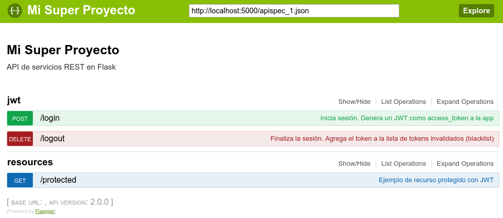
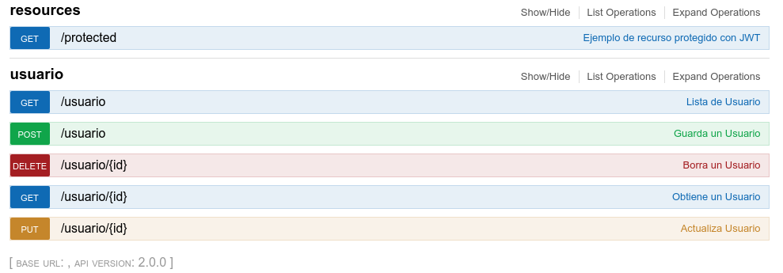

# generator-postgres-flask-restful [![NPM version][npm-image]][npm-url] [![Build Status][travis-image]][travis-url] [![Dependency Status][daviddm-image]][daviddm-url] [![Coverage percentage][coveralls-image]][coveralls-url]
> Generador de aplicaciones con Flask y Flask-Restful con JWT

## Instalación

Primero, instalar [Yeoman](http://yeoman.io) y generator-postgres-flask-restful usando [npm](https://www.npmjs.com/) (asumimos que has instalado previamente [node.js](https://nodejs.org/))

```bash
npm install -g yo
npm install -g generator-postgres-flask-restful
```

Entonces, cree un directorio y genera tu proyecto:

```bash
mkdir super-proyecto
cd super-proyecto
yo postgres-flask-restful
```

Para iniciar el proyecto, ingrese en el directorio flask y active el virtual environment recien generado

```bash
cd flask
source venv/bin/activate
python app.py
```

Debería ver algo similar a esto si es que su proyecto a sido generado sin inconvenientes:

```bash
 * Serving Flask app "app" (lazy loading)
 * Environment: production
   WARNING: Do not use the development server in a production environment.
   Use a production WSGI server instead.
 * Debug mode: off
 * Running on http://127.0.0.1:5000/ (Press CTRL+C to quit)
```

Ingrese a la dirección http://localhost:5000/ en su navegador para obetener la documentación generada por el swagger:



Por defecto el proyecto genera 3 acciones:

  - */login:* Inicia sesión. Genera un JWT como access_token a la app
  - */logout:* Finaliza la sesión. Agrega el token a la lista de tokens invalidados (blacklist)
  - */protected:* Ejemplo de recurso protegido con JWT

## Subgeneradores

### Crud

Genera servicios crud con una API REST sobre una tabla de la base de datos (ejecute el comando en la raiz del proyecto):

```bash
yo postgres-flask-restful:crud
```

Ingrese los datos a las preguntas que el generador le consulte y seleccione las tablas cuyos servicios CRUD desea generar:

```bash
     _-----_     ╭──────────────────────────╮
    |       |    │      Generador crud      │
    |--(o)--|    │ postgresql-flask-vue-cor │
   `---------´   │           eui!           │
    ( _´U`_ )    ╰──────────────────────────╯
    /___A___\   /
     |  ~  |     
   __'.___.'__   
 ´   `  |° ´ Y ` 

? Ingrese el host *localhost*
? Ingrese el puerto *5432*
? Ingrese el nombre de la base de datos *postgres*
? Ingrese el usuario *postgres*
? Ingrese el password *postgres*
? Ingrese el esquema al que quiere conectar *usuario*
connecting...
connected.
? Seleccione las tablas a generar artefactos 
 ◯ usuario.auditoria
❯◉ usuario.usuario
 ◯ usuario.usuario_historial
(Move up and down to reveal more choices)

```

Si se le pregunta si quiere sobreescribir archivos seleccione todos (opcion `a`):

```bash
...
Instrocpecting column types...
identical models/usuario.py
identical resources/usuario.py
identical swagger/usuario/list_usuario.yaml
identical swagger/usuario/get_usuario.yaml
 conflict swagger/usuario/post_usuario.yaml
? Overwrite swagger/usuario/post_usuario.yaml? overwrite this and all others
    force swagger/usuario/post_usuario.yaml
    force swagger/usuario/put_usuario.yaml
    force swagger/usuario/delete_usuario.yaml
    force app.py
...
```

Reinicie la aplicación flask (usualmente presionando Control+C en la consola y ejecutando de nuevo `python app.py` en la misma)

Los servicios generados deben aparecer en la documentación swagger correspondiente:



## Conociendo a Yeoman

 * Yeoman tiene un corazon de oro.
 * Yeoman es una persona con sentimientos y opiniones, pero se trabaja fácilmente con él. 
 * Yeoman también puede tener opiniones propias, pero puede convencersele fácilmente. 
 * Siéntete libre de [aprender más sobre Yeoman](http://yeoman.io/) 

## Licencia

Apache-2.0 © [Pedro Flores](http://codelab.com.py)


[npm-image]: https://badge.fury.io/js/generator-postgres-flask-restful.svg
[npm-url]: https://npmjs.org/package/generator-postgres-flask-restful
[travis-image]: https://travis-ci.org/neowinx/generator-postgres-flask-restful.svg?branch=master
[travis-url]: https://travis-ci.org/neowinx/generator-postgres-flask-restful
[daviddm-image]: https://david-dm.org/neowinx/generator-postgres-flask-restful.svg?theme=shields.io
[daviddm-url]: https://david-dm.org/neowinx/generator-postgres-flask-restful
[coveralls-image]: https://coveralls.io/repos/neowinx/generator-postgres-flask-restful/badge.svg
[coveralls-url]: https://coveralls.io/r/neowinx/generator-postgres-flask-restful
